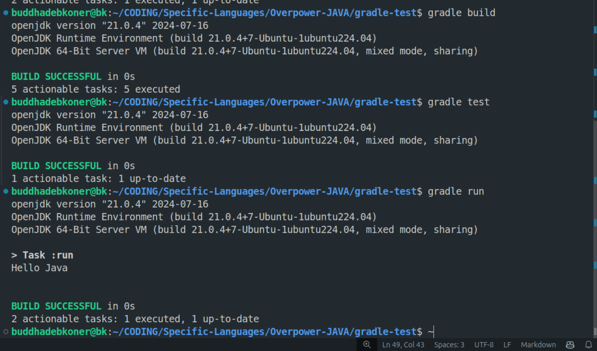

# Java Starts 11 September 2024

This repository contains projects and code written in Java, a powerful and versatile programming language used for building a wide range of applications, from mobile to enterprise-level software. Java's platform independence, object-oriented structure, and strong community support make it an excellent choice for modern software development. It offers a robust ecosystem with extensive libraries, frameworks, and tools that help streamline the development process.

### Important Note
The file name and class name should be the same, including case sensitivity, to compile with `javac` and run with `java`. 

### Compilation and Run
***Compile .java file***
```bash
javac HelloWorld.java
```
***Run .class file***
```bash
java HelloWorld
```

### First Hello Java Program


### Gradle Hello World Program

***Gradle Initial Program***
```bash
gradle init
```
***Gradle `build.gradle`***
```gradle
plugins {
    id 'java'
    id 'application'
}

// Main class without a package name
mainClassName = 'Main'
```
***Gradle Build***
```bash
gradle build
```
***Gradle Run***
```bash
gradle run
```

### First Hello Java Program

